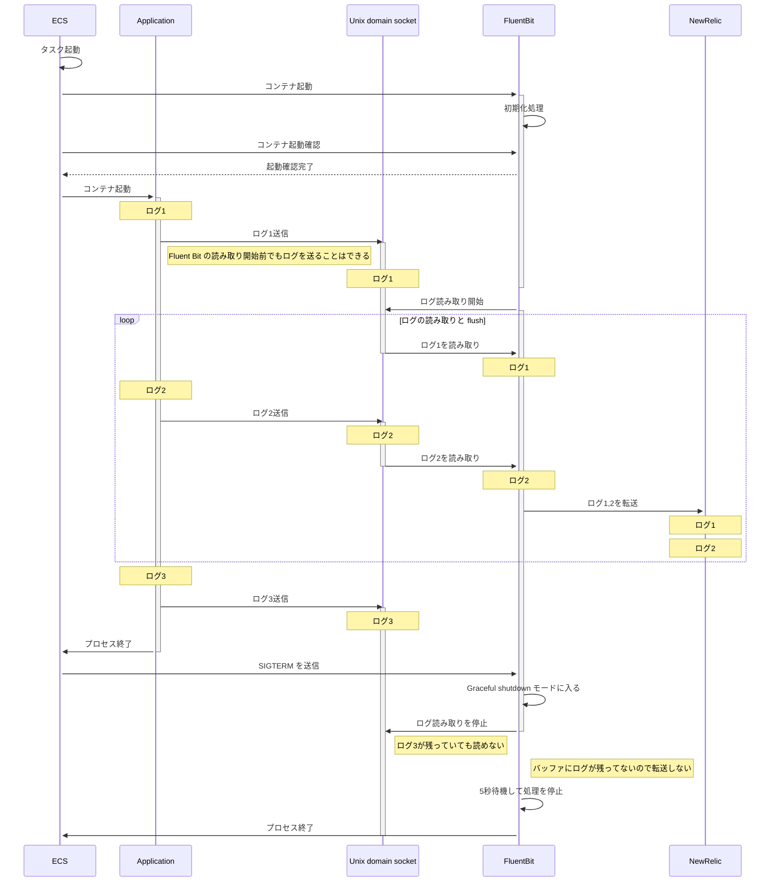

## はじめに

AWS ECS Fargateでコンテナを運用する際、ログ収集に FireLens (Fluent Bit) を使用するのは一般的な構成です。
しかし、コンテナの停止時に末尾のログが欠損する問題に遭遇したことはありませんか？
これは、プロセスの停止とログの転送のタイミングが適切に制御されていないことが原因です。
この記事では、その原因と対策について解説します。

### 想定読者

- AWS ECS Fargate + FireLens (Fluent Bit) の構成でログ欠損が発生している
- 特にアプリケーションのプロセス終了間際のログが欠損する

## TL;DR

- ECS Fargate + FireLens (Fluent Bit) の構成でアプリケーションのプロセス停止直前に出力されたログの欠損を防ぐには、**アプリケーションのプロセス停止前に適切な待ち時間が必要**
- 必要に応じて Fluent Bit の Grace Period も調整する

## 前提条件など

- ECS Fargate で稼働しているアプリケーションのログ転送に FireLens (Fluent Bit) によるサイドカーコンテナを利用している
- Fluent Bit v1.9.10, またはそれ相当のバージョンを使用しているログ転送コンテナイメージ
  - [amazon/aws-for-fluent-bit:2.32.2.20240516](https://github.com/aws/aws-for-fluent-bit/releases/tag/v2.32.2.20240516)
  - [newrelic/logging-firelens-fluentbit:2.0.0](https://github.com/newrelic/newrelic-fluent-bit-output/releases/tag/v2.0.0)

### 実際にトラブルシューティングした構成

- ECS run-task によって起動されるシンプルなバッチ処理
  - ECS サービスで構成される Web サーバーなどではこの問題はあまり顕在化しない
    - 停止前にトラフィックの draining が行われ、ほとんどの場合で必要なログの転送が終わった状態でコンテナが停止するため
    - ただし、この場合でもプロセス停止処理のログが欠損することはある
- アプリケーションは  Go で実装
- ロギングライブラリは [zerolog](https://github.com/rs/zerolog)
- Fluent Bit から New Relic に直接ログ転送
- ログ転送コンテナイメージは [newrelic/logging-firelens-fluentbit:2.1.0](https://github.com/newrelic/newrelic-fluent-bit-output/releases/tag/v2.1.0)

:::message
これ以降の説明でも最終的なログ転送先を New Relic としていますが、この記事の内容は最終的なログ転送先が New Relic であるかどうかにかかわらず、 ECS Fargate + FireLens (FluentBit) の構成で発生する問題とその対策を説明しています。
:::

## 末尾のログが欠損する問題とは

正常な場合


問題が発生している場合

:::message alert
終了時に `batch finished` が出力されていることが期待されるものの、欠損している。
:::


## 問題が発生するシナリオ

1. アプリケーションプロセスが終了間際にログを出力し、即座にプロセス停止
2. ログは一旦 ECS 基板上の Unix domain socket にバッファされる
3. ECS がアプリケーションプロセスの停止を検知
4. ECS がコンテナ停止シグナル（SIGTERM）をタスクに含まれる他のコンテナ (FluentBit など) に送信
5. SIGTERM を受信した FluentBit は Grace モードに移行し、Unix domain socket にバッファされているログの読み取りを停止
6. FluentBit が読み取る前のログが Unix domain socket に残っているものの、FluentBit が読み取りを停止したため、転送されずにログが欠損する

### シーケンス図による説明



### Fluent Bit のログから問題を説明する

前準備: Fluent Bit のデバッグログを有効にする

```json
{
  "containerDefinitions": [
    {
      "name": "log_router",
      "image": "533243300146.dkr.ecr.ap-northeast-1.amazonaws.com/newrelic/logging-firelens-fluentbit:2.1.0",
      "environment": [
        {
          "name": "FLB_LOG_LEVEL",
          "value": "debug"
        }
      ]
    }
  ]
}
```

Fluent Bit のデバッグログを有効にすることで、ログの転送がどのように行われているかの詳細を確認できます。


## 解決策：プロセス停止の待ち時間を設定する

### 1. アプリケーション側での対応

アプリケーションでプロセス終了直前の待ち時間を導入します。
これは Go 言語特有の話ですが、panic をカバーするため `defer` で `recover` しつつ、待ち時間の処理を実行しています。

:::message
具体的な待ち時間の秒数はアプリケーションの特性によって調整が必要です。
筆者が業務で運用している商用サービスの本番環境では 3 秒の待ち時間で十分な効果が得られました。
:::

```go
package main

import (
	"os"
	"time"

	"github.com/rs/zerolog/log"
)

func main() {
	var err error

	defer func() {
		// declare var because it should be panicked again after recovered.
		var r any

		if r = recover(); r != nil {
			recoverErr, ok := r.(error)
			if ok {
				log.Error().Err(recoverErr).Msg("panic occurred")
			} else {
				// logging non-error panic, typically string
				log.Error().Msgf("panic occurred: %s", r)
			}
		}

		const waitingForShutdown = 3 * time.Second

		log.Debug().Msgf("waiting for shutdown %s...", waitingForShutdown)
		time.Sleep(waitingForShutdown)

		if err != nil {
			os.Exit(1)
		}

		if r != nil {
			panic(r)
		}
	}()

	if err = run(os.Args); err != nil {
		log.Error().Err(err).Send()
	}
}
```

### 2. FluentBit の Grace Period 設定

FluentBitには、シャットダウン時にバッファされたログを転送するための待機時間を設定できます。これは`Grace`パラメータで制御します：

```conf
[SERVICE]
    Flush 1
    Grace 30
```

この設定の根拠は、AWSの公式ブログ記事「[詳解 FireLens – Amazon ECS タスクで高度なログルーティングを実現する機能を深く知る](https://aws.amazon.com/jp/blogs/news/under-the-hood-firelens-for-amazon-ecs-tasks/) [^firelens-blog]」で説明されています。

| パラメータ | 設定値 | 説明 |
|------------|--------|------|
| Flush | 1 | バッファのフラッシュ間隔を1秒に設定することで、ログの転送遅延を最小限に抑えます |
| Grace | 30 | シャットダウン時に30秒の猶予を設定することで、バッファされたログを確実に転送する時間を確保します |

これらの設定により、コンテナ停止時のログ欠損リスクを大幅に低減できます。特に `Grace 30` の設定は、リトライ可能な転送エラーが発生した場合のリトライ待機時間を十分に確保できます。リトライしきれずログ欠損が発生していることが多い場合は、この Grace の設定を検討してください。

:::message
筆者が業務で運用している商用サービスではこの設定によって解消する問題の発生が少ないこと、根本的なログ転送エラーの解消が難しいことから、この設定を導入していません。
別のアプローチでログ欠損をリカバリーする設計を検討中です。
:::

#### FluentBit設定の上書き方法

FireLens は、簡単に言うと ECS タスク定義で FluentBit の設定ファイルを生成・上書きすることができる仕組みです。これによって、ECS タスク定義で FluentBit の設定を上書きすることができます。

:::message
New Relic が提供する FireLens 用のログ転送コンテナ（`newrelic/logging-firelens-fluentbit`）は `amazon/aws-for-fluent-bit` をベースイメージとして使用している [^newrelic/logging-firelens-fluentbit-image] ため、同等の Fluent Bit の設定をカスタマイズすることが可能です。これにより、New Relic へのログ転送機能を維持しながら、Grace や Period などの基本的な Fluent Bit の設定を調整できます。
:::

```json
{
  "containerDefinitions": [
    {
      "name": "log_router",
      "image": "533243300146.dkr.ecr.ap-northeast-1.amazonaws.com/newrelic/logging-firelens-fluentbit:2.1.0",
      "firelensConfiguration": {
        "type": "fluentbit",
        "options": {
          "config-file-type": "file",
          "config-file-value": "/fluent-bit/configs/minimize-log-loss.conf"
        }
      }
    }
  ]
}
```

:::message alert
上記の `image` は ECS タスクを実行するリージョンによって異なります。
詳しくは New Relic の公式ドキュメント [^newrelic-firelens-sidcar-images-by-region] を参照してください。
:::

## 効果の確認方法

### Fluent Bit のログの確認

Fluent Bit のログを確認することで、Fluent Bit のログ読み取りと SIGTERM 受信、Graceful shutdown モードに入るタイミングを確認できます。

:::message
ここではアプリケーションのプロセス停止直前の待ち時間を10秒に設定して確認しています。
:::


### New Relic のダッシュボードによる定量的な確認

単純な方法として、アプリケーションの開始・終了時のログの数の差分を確認します。
今回は New Relic に転送したログの欠損の確認のため、 NRQL でダッシュボードを構築してみました。


:::message alert
このダッシュボードのグラフの計算は単純な方法のため、短い期間では正確な値が出ません。
ログ欠損率のグラフは最低でも数時間以上の期間で確認してください。推奨は1ヶ月以上の期間で、データポイントの間隔が1日以上です。
:::

#### ダッシュボードの構築

:::details ログ欠損率の NRQL クエリ

ECS クラスター名を変数にすることで、複数の ECS クラスターで同じダッシュボードを利用できます。

```SQL
SELECT 
  (filter(count(*), WHERE message = 'batch started') - filter(count(*), WHERE message = 'batch finished')) / filter(count(*), WHERE message = 'batch started') AS 'missing ratio(%)'
FROM Log
WHERE
  ecs_cluster = {{ecs_cluster}}
TIMESERIES AUTO
```
:::

:::details 開始・終了ログ数の NRQL クエリ

同時に別のクエリで単純なログの数も出力しておくことで、異常値の確認もできるようにします。

```SQL
SELECT
  filter(count(*), WHERE message = 'batch started') AS 'start logs(count)',
  filter(count(*), WHERE message = 'batch finished') AS 'end logs(count)'
FROM Log
WHERE ecs_cluster = {{ecs_cluster}}
TIMESERIES AUTO
```

:::

:::message
このダッシュボードを簡単に構築できるよう、[テンプレートをリポジトリで公開](https://github.com/ikasam/zenn/blob/main/examples/log-missing-dashboard.json.template)しています。
テンプレート中の `YOUR_ACCOUNT_ID` を自分の New Relic アカウント ID に置換し、ダッシュボードにインポートしてください。
:::


#### 計測に用いるアプリケーション共通の開始・終了ログの実装

アプリケーションでは `urfave/cli/v2` [^urfave-cli] を使用しているため、コマンドの Before と After を利用してコマンドの前処理と後処理でアプリケーション共通のログを出力させました。

:::message
`urfave/cli/v2` の `Command.After` は `defer` で実行される [^urfave-cli-run-after-implements] ため、アプリケーションが panic した場合でも確実に実行されます。
:::

```go
package main

import (
	"github.com/cockroachdb/errors"
	"github.com/rs/zerolog/log"
	"github.com/urfave/cli/v2"
)

func run(args []string) error {
	app := cli.NewApp()
 	app.Command = []*cli.Command{
		// コマンド定義
	}

	app.Before = func(ctx *cli.Context) error {
		log.Ctx(ctx.Context).Debug().Msg("batch started")

		return nil
	}

	app.After = func(ctx *cli.Context) error {
		log.Ctx(ctx.Context).Debug().Msg("batch finished")

		return nil
	}

  	if err := app.Run(args); err != nil {
		return errors.Wrap(err, "コマンドの実行に失敗しました")
	}

	return nil
}
```

#### ログ欠損の改善結果確認

先に示したダッシュボードのスクリーンショットのグラフの通り、対策をリリースした 12/11 以降からログ欠損率が大幅に改善しています。
改善前は 10% 近い割合でログ欠損が発生していましたが、改善後は 0.1% 未満に改善しました。


改善のリリース以降から1ヶ月弱たった現在では、全体で 0.013% のログ欠損率となっています。


一方で、バッチ処理の種類によってはログ欠損率が高いものが確認されており、これは別途対策を検討しています。


少し調査したところ、これらは Fluent Bit から New Relic へ転送するところでエラーが発生していることがわかりました。
とはいえ、根本的にログ転送のエラーを 0% にすることは不可能です。別のプラットフォーム (例えば AWS なら CloudWatch Logs や S3 など) に別途ログを転送することで、万が一のログ欠損時にリカバリすることを考えています。

## まとめ

- ECS Fargate + FireLens (Fluent Bit) の構成でアプリケーションのプロセス停止直前に出力されたログの欠損を防ぐには、**アプリケーションのプロセス停止前に適切な待ち時間が必要**
- 必要に応じて Fluent Bit の Grace Period も調整する

## 参考

- [詳解 FireLens – Amazon ECS タスクで高度なログルーティングを実現する機能を深く知る](https://aws.amazon.com/jp/blogs/news/under-the-hood-firelens-for-amazon-ecs-tasks/)
- [aws/aws-for-fluent-bit](https://github.com/aws/aws-for-fluent-bit)
- [newrelic/logging-firelens-fluentbit](https://github.com/newrelic/newrelic-fluent-bit-output)
- [Forward AWS services logs to New Relic](https://docs.newrelic.com/jp/install/aws-logs/?service=ECS&forward_ECS=sidecar_firelens)
- [urfave/cli](https://github.com/urfave/cli)

[^firelens-blog]: [詳解 FireLens – Amazon ECS タスクで高度なログルーティングを実現する機能を深く知る](https://aws.amazon.com/jp/blogs/news/under-the-hood-firelens-for-amazon-ecs-tasks/)
[^newrelic/logging-firelens-fluentbit-image]: [newrelic/newrelic-fluent-bit-output/Dockerfile_firelens](https://github.com/newrelic/newrelic-fluent-bit-output/blob/5854a3f3cffc49f251c9ef15bec714e44e7969a8/Dockerfile_firelens#L21-L22)
[^newrelic-firelens-sidcar-images-by-region]: https://docs.newrelic.com/jp/install/aws-logs/?service=ECS&forward_ECS=sidecar_firelens#image-names
[^urfave-cli]: [urfave/cli](https://github.com/urfave/cli)
[^urfave-cli-run-after-implements]: [urfave/cli/v2.27.5/command.go#L195-L207](https://github.com/urfave/cli/blob/f035ffaa3749afda2cd26fb824aa940747297ef1/command.go#L195-L207)
